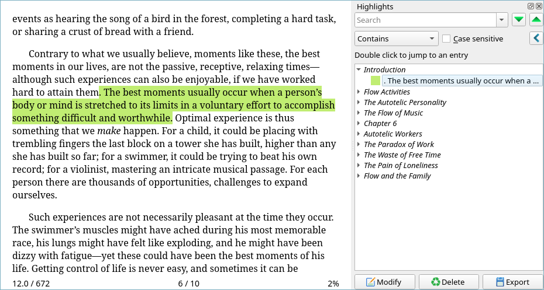

# 📚 Kobo Highlights to Calibre

> Import Kobo highlights to [Calibre](https://calibre-ebook.com/).

## Overview

Import your Kobo e-reader highlights into Calibre e-book viewer.

Calibre's built-in viewer supports highlights
[since 5.0](https://calibre-ebook.com/new-in/fourteen). Thanks to this
script, you can populate the native Calibre highlights with the
highlights from your Kobo e-reader.

This is different from Calibre's
[Annotations](https://www.mobileread.com/forums/showthread.php?t=241206)
[plugin](https://github.com/davidfor/calibre-annotations) which
concatenates the text of all your highlights in a new metadata field in
your books library, this script plugs them directly into Calibre's
native reader highlighting feature.



**Warning:** this works by writing directly to `metadata.db` in your
Calibre library. It only inserts into the `annotations` table and only
updates the rows it inserted (addressed by highlight UUID). I would
still recommend you do a backup of your `metadata.db` before running
this just in case.

See all the [details](#details) below.

## Dependencies

* [Node.js](https://nodejs.org/)

## Installation

```sh
git clone https://github.com/valeriangalliat/kobo-highlights-to-calibre.git
cd kobo-highlights-to-calibre
npm install
```

## Usage

```sh
node index.js <kobo-volume> <calibre-library>
```

Example:

```sh
node index.js "/run/media/$USER/KOBOeReader" "$HOME/Calibre Library"
```

## Updating highlights

Creating highlights should work fine, but if you want to update
highlight data (e.g. when working on the script), you might notice that
Calibre restores the previous state of the highlight when you open the
viewer!

This is because Calibre stores a copy of the highlight data from its
database in a bunch of different files.

The best way to identify those is to run:

```sh
grep -R --files-with-matches <uuid> ~/.cache/calibre ~/.config/calibre ~/Calibre\ Library
```

Where `<uuid>` is the UUID of the highlight you're working with.

It will yield something like this:

```
~/.cache/calibre/some/random/stuff/calibre-book-annotations.json
~/.config/calibre/viewer/annots/some-random-hash.json
~/.config/calibre/plugins/annotations.db
~/Calibre Library/path/to/book/metadata.opf
~/Calibre Library/metadata.db
```

I usually delete the JSON files in `~/.cache` and `~/.config`, and I
also manually remove the specific bookmark from the `metadata.opf` XML
file.

Then running the script again and opening the viewer should show the
updated highlight.

## Details

This project is inspired by
[Kobo2Calibre](https://github.com/degiz/kobo2calibre), and while this
program didn't work for me (Python dependencies issues and
incompatibilities with 3.10), plus the fact I wasn't super keen on
depending on a natural language processing (NLP) model for this task, it
really helped me to figure everything I needed to build my own version.

Here's the gist.

### The Kobo bookkeeping (literally) database

When mounted over USB, the Kobo volume contains a `.kobo` directory,
with a bunch of interesting things in it.

One of them is `KoboReader.sqlite`, a SQLite database containing even
more interesting things, including a `Bookmark` table with the highlight
data.

```
$ sqlite3 .kobo/KoboReader.sqlite

sqlite> .tables
AbTest                 KoboPlusAssets         Wishlist
Achievement            OverDriveCards         WordList
Activity               OverDriveCheckoutBook  content
AnalyticsEvents        OverDriveLibrary       content_keys
Authors                Reviews                content_settings
BookAuthors            Rules                  ratings
Bookmark               Shelf                  shortcover_page
DbVersion              ShelfContent           user
DropboxItem            SubscriptionProducts   volume_shortcovers
Event                  SyncQueue              volume_tabs
KoboPlusAssetGroup     Tab

sqlite> .schema --indent Bookmark
CREATE TABLE Bookmark(
  BookmarkID TEXT NOT NULL,
  VolumeID TEXT NOT NULL,
  ContentID TEXT NOT NULL,
  StartContainerPath TEXT NOT NULL,
  StartContainerChildIndex INTEGER NOT NULL,
  StartOffset INTEGER NOT NULL,
  EndContainerPath TEXT NOT NULL,
  EndContainerChildIndex INTEGER NOT NULL,
  EndOffset INTEGER NOT NULL,
  Text TEXT,
  Annotation TEXT,
  ExtraAnnotationData BLOB,
  DateCreated TEXT,
  ChapterProgress REAL NOT NULL DEFAULT 0,
  Hidden BOOL NOT NULL DEFAULT 0,
  Version TEXT,
  DateModified TEXT,
  Creator TEXT,
  UUID TEXT,
  UserID TEXT,
  SyncTime TEXT,
  Published BIT default false,
  ContextString TEXT,
  Type TEXT,
  PRIMARY KEY(BookmarkID)
);
CREATE INDEX bookmark_content ON bookmark(ContentID);
CREATE INDEX bookmark_volume ON bookmark(VolumeID);
```

If we look at a specific highlight of mine:

```
sqlite> select * from Bookmark where Text like '%The best moments%';
              BookmarkID = d0d2f956-f666-4214-90a2-0423530e622e
                VolumeID = file:///mnt/onboard/Csikszentmihalyi, Mihaly/Flow - Mihaly Csikszentmihalyi.epub
               ContentID = file:///mnt/onboard/Csikszentmihalyi, Mihaly/Flow - Mihaly Csikszentmihalyi.epub#(6)OEBPS/cha01.xhtml
      StartContainerPath = OEBPS/cha01.xhtml#point(/1/4/2/26/1:223)
StartContainerChildIndex = -99
             StartOffset = 0
        EndContainerPath = OEBPS/cha01.xhtml#point(/1/4/2/26/1:385)
  EndContainerChildIndex = -99
               EndOffset = 0
                    Text = . The best moments usually occur when a person’s body or mind is stretched to its limits in a voluntary effort to accomplish something difficult and worthwhile.
              Annotation = 
     ExtraAnnotationData = ¤
             DateCreated = 2022-03-08T03:55:38.421
         ChapterProgress = 0.0315533980582524
                  Hidden = false
                 Version = ¤
            DateModified = ¤
                 Creator = ¤
                    UUID = ¤
                  UserID = 2b54ff11-671f-4853-a4a7-a98bb20d9836
                SyncTime = ¤
               Published = false
           ContextString = ¤
                    Type = highlight
```

Here we got:

* A UUID in `BookmarkID` that we can use to identify this highlight
  uniquely.
* A `VolumeID` which doesn't have any join in this database but refers
  to a file on the volume.
* A `ContentID` that has a join with the `Content` table, useful to get
  the book title and the chapter title for a given highlight.
* The start and end path of the highlight (`StartContainerPath` and
  `EndContainerPath`). In my case `StartOffset` and `EndOffset` seem
  unused and the offset is part of the path (more on that later).
* The highlighted `Text`.

So what do we do with those start and end paths? Well, let's see what
an EPUB is made of (BTW this only supports EPUB for now, I don't use
other formats and I have no clue what they look like).

### What is an EPUB made of?

It turns out an EPUB is just a ZIP archive containing a bunch of
metadata XML and content HTML files. So in the path
`OEBPS/cha01.xhtml#point(/1/4/2/26/1:223)`, Kobo means we're looking at
the file `OEBPS/cha01.xhtml` in the ZIP archive, and the point we're
targeting is `/1/4/2/26/1:223`. But what is `/1/4/2/26/1:223`?

### Canonical fragment identifiers (CFI)

There's a thing in the EPUB spec called
[canonical fragment identifiers (CFI)](http://idpf.org/epub/linking/cfi/),
which look a lot like those Kobo path fragments.

How do they work? [epub-cfi-resolver](https://github.com/fread-ink/epub-cfi-resolver) 
does a great job at [explaining this](https://github.com/fread-ink/epub-cfi-resolver#about-epub-cfi).

Essentially, `/1/4/2/26/1:223` means we're looking at the 223th
character of the first child node of the 26th child node of the... you get
the idea.

The trick is that CFI differs from the DOM standard and counts element
nodes with even numbers and text and CDATA nodes with odd numbers.
There's also a bunch of rules about combining and counting adjacent text
nodes.

So in DOM terms, the above path is actually 223th character of the first
text node of the 13th element node of the 1st element node of the second
element node of the first text node.

That last part doesn't make any sense, because a XML document root isn't
a text node. This is a Kobo quirk and we need to deal with it. Most
valid CFI paths otherwise start with `/2/` for the root node.

### Bytes vs. characters

The next fun thing is about the text offset. See, in `/1/4/2/26/1:223`,
the spec defines the offset following the `:` character as a "character
offset". But Kobo actually puts a byte offset in there.

This is why if you forward this offset as is, you'll notice that in
Calibre viewer, the highlights are often shifted by a few characters.

Why is the byte offset different from the character offset? Because some
characters can span on multiple bytes (hello Unicode).

**Fun fact:** this is the reason why [Kobo2Calibre](https://github.com/degiz/kobo2calibre)
depends on a natural language processing model, by identifying the
sentence boundaries they can work around the shift that's otherwise
introduced by the Kobo bytes vs. characters offset problem.

So there's some extra massaging to be done here to make sure we identify
the real Unicode character offset from the byte offset we have. This is
tricky because of the rules around text and CDATA nodes in the CFI spec,
but overall it seems that an incomplete implementation that just works
with the current DOM text node without any CFI-specific handling works
quite well in most cases.

### Other issues

Now, this works the majority of the time, but I still get some
highlights that are off, and other highlights that just don't show at
all on the Calibre side.

I tried to debug those a bit, but from what I can tell, Kobo's path
(other than the quirks we talked about earlier) matches perfectly with
the compliant [epub-cfi-resolver](https://github.com/fread-ink/epub-cfi-resolver)
implementation, so the issues might be more on the Calibre side?

There's basically two issues I identified:

* Sometimes Kobo targets empty text nodes in between paragraphs as the
  start or end point, and this can confuse Calibre. It would work better
  if we targeted the first or last character of a paragraph text node
  instead.
* There's some cases where Calibre's idea of text nodes doesn't seem to
  match the implementation of Kobo nor epub-cfi-resolver and I can't
  myself understand their logic based on my comprehension of the spec. I
  don't think those are easily fixable but luckily it represents a small
  subset of highlights for me.
